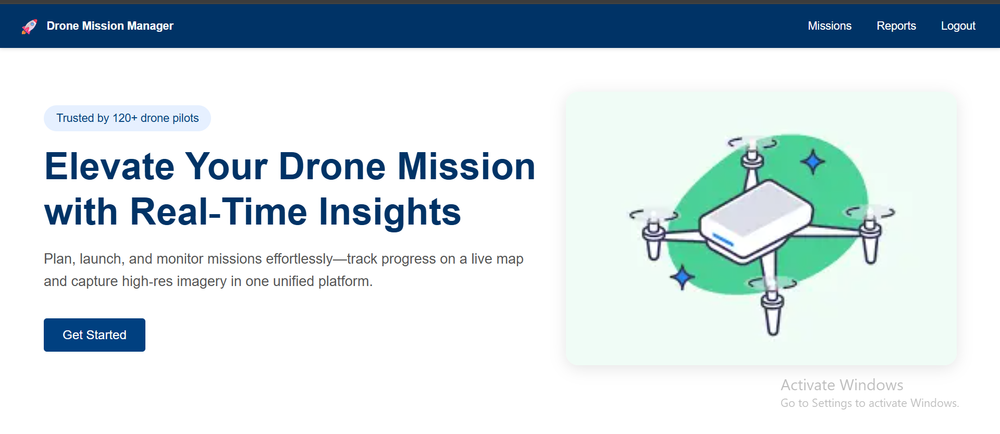
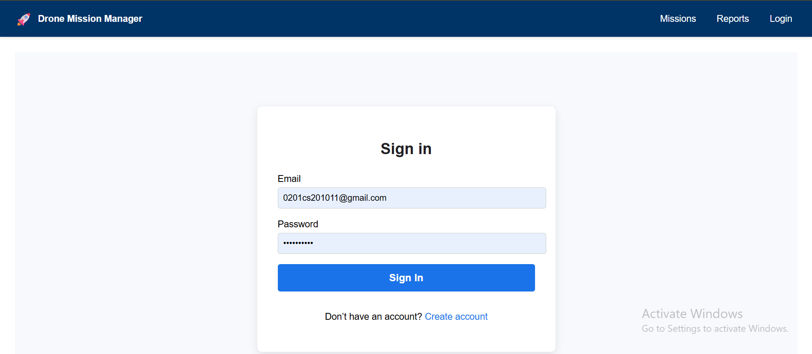
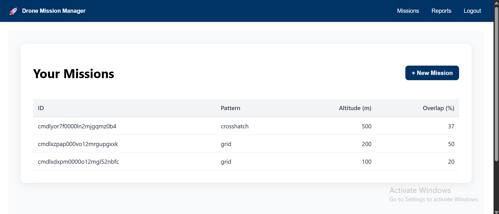
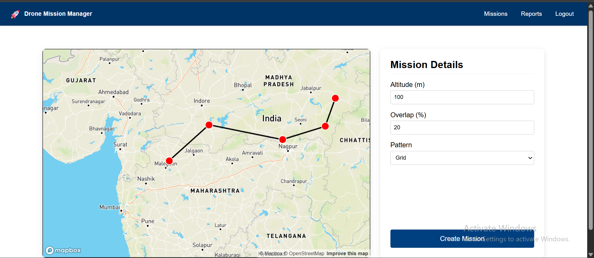
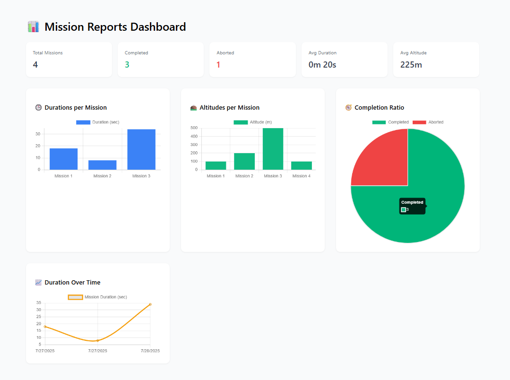

# 🛰️ Drone Survey Management System – Frontend

This is the frontend interface for the Drone Survey Management System, providing an interactive and real-time dashboard for drone operators to manage, monitor, and analyze missions with ease.

Built with **Next.js (App Router)** and **Firebase Authentication**, the UI is responsive, fast, and designed for operational clarity.

---

## ✨ Features

* 🔐 **Authentication** via Firebase (email/password or third-party)
* 🗺️ **Create & configure missions** with waypoints, altitude, and pattern
* 📍 **Live mission monitoring** with real-time telemetry and progress
* ⏯️ **Mission control**: pause, resume, abort drones mid-flight
* 📊 **Reports dashboard** with charts (duration, altitude, count)
* 🎨 Clean, modular, and component-driven UI

---

## 🧱 Tech Stack

| Layer           | Technology                   |
| :-------------- | :--------------------------- |
| Framework       | Next.js (App Router)         |
| Auth            | Firebase Auth                |
| State & Hooks   | React, Context API           |
| Charts          | Chart.js (via react-chartjs-2) |
| API             | REST calls to FastAPI backend |
| Styles          | Tailwind CSS                 |
| Deployment      | Vercel / Docker (optional)   |

---

## 📸 UI Screenshots

> _Replace the placeholder image links below with your actual screenshots._

### 🔐 Home Page


---
### 🔐 Auth


---
### 🔐 Missions



### 🗺️ Create Mission


---

### 📡 Live Mission Monitoring


---

### 📊 Reports Dashboard


---

## 🧪 Running Locally

### 1️⃣ Clone and install

```bash
git clone [https://github.com/your-org/dsm-frontend.git](https://github.com/your-org/dsm-frontend.git)
cd dsm-frontend
npm install
````

### 2️⃣ Configure `.env.local`

```env
NEXT_PUBLIC_API_BASE_URL=http://localhost:4000
NEXT_PUBLIC_FIREBASE_API_KEY=your_key
NEXT_PUBLIC_FIREBASE_AUTH_DOMAIN=your_domain
NEXT_PUBLIC_FIREBASE_PROJECT_ID=your_id
```

### 3️⃣ Start the dev server

```bash
npm run dev
```

Access the app at [http://localhost:3000](https://www.google.com/search?q=http://localhost:3000)

-----

-----

## 🔒 Authentication Strategy

  * **Firebase** handles all authentication logic, streamlining user management.
  * The frontend uses `onAuthStateChanged` for robust **session management**.
  * **Protected routes** automatically redirect unauthenticated users to the `/login` page.

-----

## 🌍 API Integration

| Endpoint                    | Purpose                        |
| :-------------------------- | :----------------------------- |
| `GET /missions`             | List user’s missions           |
| `POST /missions`            | Create new mission             |
| `GET /missions/:id`         | Get mission + waypoints        |
| `GET /logs/:id/stream`      | Live telemetry (Socket.IO)   |
| `PATCH /missions/:id/abort` | Abort mission                  |
| `GET /reports/summary`      | Analytics summary              |

-----

## 🧠 Development Approach

### ✅ Problem-solving strategy

  * We prioritized critical user workflows, including mission creation, monitoring, control, and analysis.
  * Focused on **real-time** telemetry and providing clear feedback on mission status.
  * Utilized a **simple, responsive UI** design to ensure scalability across various devices.

### ⚖️ Trade-offs considered

| Decision                      | Trade-off / Reason                                |
| :---------------------------- | :------------------------------------------------ |
| Firebase instead of custom auth | Faster authentication and enhanced security, avoiding boilerplate code. |
| Chart.js for data visualization | Simple and flexible for immediate needs, though offers limited advanced customization. |
| Next.js App Router            | Future-proof architecture with built-in routing and layout capabilities. |

-----

## 🛡️ Safety & Adaptability

  * ⚙️ Real-time updates via Socket.IO eliminate the need for constant API polling, reducing server load.
  * 🌐 The UI is designed to work seamlessly for **multiple concurrent users and missions** thanks to session isolation and efficient use of Redis channels.

